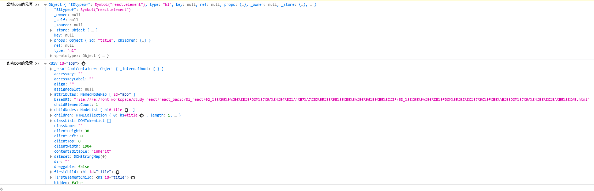

# React的快速开始

> 引入核心依赖包

需要注意的是React的库文件引入是有顺序的，而引入的顺序以下面列出的顺序一致

```text
react.development.js # 核心库
react-dom.development.js # react操作DOM的库
babel.min.js
prop-types.js
```

> 创建html页面

在创建的Html页面中给与React操作的容器, 该容器可以为一个`div`标签, 因为React需要知道他操作的容器是哪个, 如以下Demo所示。

```html
<!DOCTYPE html>
<html lang="en">
<head>
    <meta charset="UTF-8">
    <meta http-equiv="X-UA-Compatible" content="IE=edge">
    <meta name="viewport" content="width=device-width, initial-scale=1.0">
    <title>hello_react</title>
</head>
<body>
    <!-- 准备好React的"容器" -->
    <div id="test">
        
    </div>

    <!-- 引入react的核心库 -->
    <script src="../js/react.development.js" type="text/javascript"></script>
    <!-- 引入react-dom用于支持react操作dom -->
    <script src="../js/react-dom.development.js" type="text/javascript"></script>
    <!-- 引入babel用于将jsx转换为js -->
    <script src="../js/babel.min.js" type="text/javascript"></script>

    <!-- 注意：这里必须要写babel因为我们写的是jsx并且需要babel翻译成为js，并且必须写，因为不写默认是js -->
    <script type="text/babel">
        // 1. 创建虚拟DOM
        const VDOM = <h1>HelloReact</h1> // 在jsx中字符串不用写字符串, 并且是一定的，因为他不是字符串，他是React的虚拟DOM

        // 2. 渲染虚拟DOM到页面
        // ReactDOM.render(虚拟DOM, 容器)
        ReactDOM.render(VDOM, document.getElementById("test"))

    </script>
    
</body>
</html>
```

> 此时打开使用浏览器打开页面


## 小结及注意点

> 在引用React核心库的时候一定要记住他们是有顺序的。

> 在编写React脚本语句时一定要注意`type`属性中必须是`text/babel`否则会报错

> 在定义React`虚拟DOM`的时候他并不是字符串, 如果加上引号那么则说明这整个字符串是一个虚拟DOM的值，所以如果想让标签奏效则不能添加引号

> `ReactDOM.render(虚拟DOM, 容器)`语句是重写操作并不是追加操作，如果需要添加多个DOM元素则不能使用多次添加的方式

# 虚拟DOM的两种创建方式

## JSX（JavaScriptXml）

```javascript
<script type="text/babel">
    // 创建ReactDOM
    // 使用JSX方式创建标签时，如果有多行标签可以使用`()`括住
    const VDOM = (
        <h1 id="title">
            <span id="bnyte">HelloReact</span>
        </h1>
    )
    
    ReactDOM.render(VDOM, document.getElementById("app"))

</script>
```

## JavaScript

```javascript
<script type="text/javascript">
    // 创建ReactDOM
    // const VDOM = React.createElement("标签名", "标签属性格式：{key:value}", "标签值")
    const VDOM = React.createElement("h1", {"id": "title"}, React.createElement("span", {"id":"bnyte"}, "HelloReact"))

    // 渲染视图
    ReactDOM.render(VDOM, document.getElementById("app"))
</script>
```

## 小结

> 在使用JSX方式创建虚拟DOM时可以直接使用Html原生写法创建，但是JSX方式只会支持一个虚拟DOM中有一个跟标签存在，不允许有多个跟标签的存在

> 在使用原生js的方式创建虚拟DOM的时候需要借助`React`核心库中的`React对象中的createElement()`方法进行创建

> 就算使用了JSX方式创建了虚拟DOM那么他最终依然会被`babel`转换成使用`原生JS`的方式，然后去创建虚拟DOM实例

## tips

> 虚拟dom和真实dom的区别

1. 他们都是对象, 并且不是集合等其他的对象, 只是一个简单的Objct对象
2. 虚拟DOM的对象信息相对于真实DOM对象来说，他的信息比真实DOM更少



# JSX的语法规则

> 虚拟DOM中获取普通变量值

```javascript
<script type="text/babel">
    const name = "bnyte"
    const age = 16

    // 创建ReactDOM
    const VDOM = (
        <h1>
            <span id="bnyte">name &gt;&gt; {name}</span> // 取值使用`{}`标记
            <br />
            <span id="bnyte">age &gt;&gt; {age}</span>
        </h1>
    )

    // 渲染React
    ReactDOM.render(VDOM, document.getElementById("app"))
</script>
```

> 获取css中的样式

```javascript
<script type="text/babel">
    
    // 创建ReactDOM
    /*
        *  引入css样式直接写即可, 但是不推荐因为这是错误的写法，这样的话会抛出异常
        *  `Invalid DOM property `class`. Did you mean `className`?`，也就是说我们应该是用`className`属性来指定样式
        */
    const VDOM = (
        <h1>
            <span className="title" id="bnyte">name &gt;&gt; {name}</span>
            <br />
            <span >age &gt;&gt; {age}</span>
            <br />
            <span>arr &gt;&gt; {arr}</span>
        </h1>
    )

    // 渲染React
    ReactDOM.render(VDOM, document.getElementById("app"))
</script>
```

```html
<style>
    .title{
        background-color: palevioletred;
        width: 20px;
    }
</style>
```

> 小Demo, 遍历

```javascript
<script type="text/babel">
    
    // 定义常量
    const users = ["ggboy", "bnyte", "大帅哥"]

    // 需要注意的是每个相同的标签都应该有一个唯一的key属性, React就是通过这个key来获取不同的标签
    const VDOM = (
        <ul>
            {
                users.map((value, index) => {
                    return <li key={index}>{value}</li>
                })
            }
        </ul>
    )

    // 获取容器
    ReactDOM.render(VDOM, document.getElementById("app"))
</script>
```

## 小结

> 引入css样式直接写即可, 但是不推荐因为这是错误的写法，这样的话会抛出异常`Invalid DOM property `class`. Did you mean `className`?`，也就是说我们应该是用`className`属性来指定样式

> 需要注意的是每个相同的标签都应该有一个唯一的key属性, React就是通过这个key来获取不同的标签

# 面向组件编程

> 函数式组件-简单组件(无状态组件)

```javascript
<script type="text/babel">
    // 创建函数式组件
    function Demo() {
        return <h1>这是函数式组件编程</h1>
    }
    // 引用函数式组件, 需要注意的是引用函数式组件的时候必须使用标签的方式引入并且首字母必须大写，并且标签必须闭合
    // 这个时候在函数式组件中的数据不在是一个虚拟DOM，他是一个函数式组件的返回值，通过这个返回值作为虚拟DOM
    // 如果组件之间返回了字符串之类的数据而并不是虚拟DOM的话那么则会将所有的数据全部直接生成为DOM元素不做任何操作。
    ReactDOM.render(<Demo/>, document.getElementById("app"))

</script>
```

## state

> 类式组件-复杂组件(有状态组件)

```javascript
<script type="text/babel">
    /**
     * 1. 在构造器中没有初始化state的情况下，在类组件函数(方法)中的state不能直接使用`setState`的API去进行赋值，主要原因是因为所有的对象都是通过类的构造器初始化, 
     *      而我在构造器中调用了`this.state = this.setState()`因为此时的`HelloComponent`还没有完成实例化, 这个时候调用`setState()`会抛出空指针。
     * 2. 需要注意的是不要在render()中去调用`setState()`因为在React中每次调用`setState()`都会调用当前实例的`render()`而我又在`runder()`中调用了`setState()`所以导致压栈, 因该和栈溢出等价吧
     * 3. 在`构造器`和`render()`中的`this`是会指向当前实例对象的, 也就是说在这两个方法中我调用this可以拿到实例对象中的数据比如`state`等，但是在其他的方法中无法拿到当前this
     * 4. `render()`是`React`渲染虚拟DOM成为真实DOM的方法, 也就是说所有的对虚拟DOM操作最后都会调用render()被React给渲染成为真实DOM然后在页面中展示
     * 5. 在JavaScript中当调用方法时如果带了括号则是执行方法, 如果不带括号则是拿该方法的地址值然后作为返回值供接收使用，就算是已经吧当前方法的地址引用交给了一个变量，但是这个变量在调用的时候依然需要添加括号，否则还是返回地址值并不会调用。
     * 6. React的元素不仅可以是虚拟DOM也可以是一个组件。
     * 7. 在React中调用同类中的方法时候如果绑定时间调用方法那么需要将传统JS中的事件名称转换为驼峰，然后值为固定模式：`{functionName}`，如绑定点击事件的目标执行方法look：onClick={look}
     * 8. 在React虚拟DOM中不可以直接放入对象类型的模板，必须放置字符串形式的数据。
     * 9. 在React中的`setState()`是追加方式更新值，类似与`Java中的Map`集合的`put()`
     */
    class HelloComponent extends React.Component {

        constructor(props) {
            super(props)
            this.state = {"date": new Date(), "userName": "猪猪侠", "isLook": true, "lookName": "帝皇铠甲"}
            // 前面的是定义属性, 后面是找当前类的原型对象中是否包含
            // 这一行主要解决this指针问题, 原理就是赋值改变this指向，也就是说获取当前类的原型中的look函数，然后绑定当前this指向给这个原型对象中，然后将返回值又赋值给了定义类的属性this.look
            this.look = this.look.bind(this) 
        }

        render() {
            // 不能直接将date对象放入React虚拟DOM中，必须放置一个字符串，否则React是无法完成解析的
            const currentTime = new Date().toDateString()
            return (
                <h1 onClick={this.look}>
                    现在是 {currentTime}
                    {
                        this.state.isLook ? this.state.lookName : this.state.userName
                    }
                </h1>
            )
        }

        look() {
            this.setState({"isLook": !this.state.isLook})
            this.state.isLook ? this.state.lookName : this.state.userName
            console.log(this.state.isLook);
        }
    }

    ReactDOM.render(<HelloComponent />, document.getElementById("app"))

</script>
```

## 精简state

```javascript
<!DOCTYPE html>
<html lang="zh-CN">
<head>
    <meta charset="UTF-8">
    <meta http-equiv="X-UA-Compatible" content="IE=edge">
    <meta name="viewport" content="width=device-width, initial-scale=1.0">
    <title>02_复杂式组件</title>
</head>
<body>
    <!-- React操作容器 -->
    <div id="app"></div>
    
    <!-- 引入react的核心库 -->
    <script src="../js/react.development.js" type="text/javascript"></script>
    <!-- 引入react-dom用于支持react操作dom -->
    <script src="../js/react-dom.development.js" type="text/javascript"></script>
    <!-- 引入babel用于将jsx转换为js -->
    <script src="../js/babel.min.js" type="text/javascript"></script>

    <script type="text/babel">
        class HelloComponent extends React.Component {

            state = {"date": new Date(), "userName": "猪猪侠", "isLook": true, "lookName": "帝皇铠甲"}

            render() {
                // 不能直接将date对象放入React虚拟DOM中，必须放置一个字符串，否则React是无法完成解析的
                const currentTime = new Date().toDateString()
                return (
                    <h1 onClick={this.look}>
                        现在是 {currentTime}
                        {
                            this.state.isLook ? this.state.lookName : this.state.userName
                        }
                    </h1>
                )
            }

            look = ()=> {
                this.setState({"isLook": !this.state.isLook})
                this.state.isLook ? this.state.lookName : this.state.userName
                console.log(this.state.isLook);
            }

            
        }

        ReactDOM.render(<HelloComponent />, document.getElementById("app"))

    </script>
</body>
</html>
```

## 小结

- 在React中不能直接将对象数据类型放到虚拟DOM中让他渲染，React只认识字符串而不认识任何对象，它只认识虚拟DOM和字符串。
- 在React中如果在构造器中调用`setState()`API是不可以的，因为他会通过原型链去找，但是找到当前组件的实例没有就会去React的组件跟父类找，但是因为默认在函数中使用严格模式的所以此时调用会出现空指针。
- 在React中所有类组件必须继承`React.Component`这个类。
- 在React中的组件有一个`render()`这是React将`render()`的返回值作为虚拟DOM，然后将这个虚拟DOM转换为真实的DOM对象，需要注意的是：每调用一次`setState()`API都会隐式调用一次`render()`
- 在React中的`setState()`是追加方式更新值，类似与`Java中的Map`集合的`put()`
- 不能直接将JS对象放入React虚拟DOM中，因为React渲染时无法完成对JS对象的解析

## props

### props的基本使用

```javascript
<!DOCTYPE html>
<html lang="zh-CN">
<head>
    <meta charset="UTF-8">
    <meta http-equiv="X-UA-Compatible" content="IE=edge">
    <meta name="viewport" content="width=device-width, initial-scale=1.0">
    <title>02_复杂式组件</title>
</head>
<body>
    <!-- React操作容器 -->
    <div id="app00"></div>
    <div id="app01"></div>
    <div id="app02"></div>
    
    <!-- 引入react的核心库 -->
    <script src="../../js/react.development.js" type="text/javascript"></script>
    <!-- 引入react-dom用于支持react操作dom -->
    <script src="../../js/react-dom.development.js" type="text/javascript"></script>
    <!-- 引入babel用于将jsx转换为js -->
    <script src="../../js/babel.min.js" type="text/javascript"></script>

    <script type="text/babel">
        // 创建组件
        class Person extends React.Component {
  
            // 渲染虚拟DOM核心方法
            render() {
                console.log(this.props);
                return (
                    <div>
                        <ul>
                            <li>姓名：{this.props.name}</li>
                            <li>性别：{this.props.gender}</li>
                            <li>年龄：{this.props.age}</li>
                        </ul>
                    </div>
                )
            }
        }

        // 渲染虚拟DOM
        ReactDOM.render(<Person name="猪猪侠" gender="男" age="18"/>, document.getElementById("app00"))
        ReactDOM.render(<Person name="帝皇铠甲" gender="女" age="15"/>, document.getElementById("app01"))
        ReactDOM.render(<Person name="霹雳火" gender="男" age="20"/>, document.getElementById("app02"))

    </script>
</body>
</html>
```

### 批量传递props

```javascript
<!DOCTYPE html>
<html lang="zh-CN">
<head>
    <meta charset="UTF-8">
    <meta http-equiv="X-UA-Compatible" content="IE=edge">
    <meta name="viewport" content="width=device-width, initial-scale=1.0">
    <title>02_复杂式组件</title>
</head>
<body>
    <!-- React操作容器 -->
    <div id="app00"></div>
    <div id="app01"></div>
    <div id="app02"></div>
    
    <!-- 引入react的核心库 -->·
    <script src="../../js/react.development.js" type="text/javascript"></script>
    <!-- 引入react-dom用于支持react操作dom -->
    <script src="../../js/react-dom.development.js" type="text/javascript"></script>
    <!-- 引入babel用于将jsx转换为js -->
    <script src="../../js/babel.min.js" type="text/javascript"></script>

    <script type="text/babel">
        // 创建组件
        class Person extends React.Component {
  
            // 渲染虚拟DOM核心方法
            render() {
                console.log(this.props);
                const {name, gender, age} = this.props
                return (
                    <div>
                        <ul>
                            <li>姓名：{this.props.name}</li>
                            <li>性别：{this.props.gender}</li>
                            <li>年龄：{this.props.age + 1}</li>
                        </ul>
                    </div>
                )
            }
        }

        const p1 = {name: "猪猪侠", gender: "男", age: 18}
        const p2 = {name: "帝皇铠甲", gender: "女", age: 15}
        const p3 = {name: "霹雳火", gender: "男", age: 20}

        // 渲染虚拟DOM
        ReactDOM.render(<Person {...p1} />, document.getElementById("app00"))
        ReactDOM.render(<Person {...p2} />, document.getElementById("app01"))
        ReactDOM.render(<Person {...p3} />, document.getElementById("app02"))

        /**
         *  ...[对象变量名] 
         *      这中方式写法就是将当前变量对象的所有属性便利类似，类似于Spring中的属性copy赋值
         *      也就是说，两个对象的属性名完全一致则可以完成属性的值拷贝，这里类似，只不过他在去取值的时候
         *      如：传递的p1有 name和age 那就只能在props中通过name和age属性才能够获取到当前属性的值
         *  注意：
         *      这种展开运算符要想在React中使用需要先引入React然后还需要引入Babel才可以使用这种方式。当然默认情况都会引入所以都能使用
         *      并且他仅仅适用于标签运算符中，其他任何地方就算写了也将不会起到任何作用                  
         */

    </script>
</body>
</html>
```

### 对props做限制

```javascript
<!DOCTYPE html>
<html lang="zh-CN">
<head>
    <meta charset="UTF-8">
    <meta http-equiv="X-UA-Compatible" content="IE=edge">
    <meta name="viewport" content="width=device-width, initial-scale=1.0">
    <title>02_复杂式组件</title>
</head>
<body>
    <!-- React操作容器 -->
    <div id="app00"></div>
    <div id="app01"></div>
    <div id="app02"></div>
    
    <!-- 引入react的核心库 -->
    <script src="../../js/react.development.js" type="text/javascript"></script>
    <!-- 引入react-dom用于支持react操作dom -->
    <script src="../../js/react-dom.development.js" type="text/javascript"></script>
    <!-- 引入babel用于将jsx转换为js -->
    <script src="../../js/babel.min.js" type="text/javascript"></script>
    <!-- 引入prop-types 用于对组件属性的限制 -->
    <script src="../../js/prop-types.js" type="text/javascript"></script>

    <script type="text/babel">
        // 创建组件
        class Person extends React.Component {
  
            // 渲染虚拟DOM核心方法
            render() {
                console.log(this.props);
                return (
                    <div>
                        <ul>
                            <li>姓名：{this.props.name}</li>
                            <li>性别：{this.props.gender}</li>
                            <li>年龄：{this.props.age + 1}</li>
                        </ul>
                    </div>
                )
            }
        }

        // 对属性做类型和必填约束
        Person.propTypes = {
            name: PropTypes.string.isRequired, // name属性必须是字符串 并且是必填
            gender: PropTypes.string, // gender属性必须是字符串
            age: PropTypes.number, // age属性必须是数值
            speck: PropTypes.func // 限制speck必须是函数
        }

        // 对属性设置默认值, 需要注意的是如果传入的值是null那么不算空值，只有在为undefined的时候才算空值，此时才会设置默认值
        Person.defaultProps = {
            gender: "男男女女" // gender属性默认值为男男女女
        }

        let p = {name: "猪猪侠",  age: 18}
        // 渲染虚拟DOM
        ReactDOM.render(<Person {...p} />, document.getElementById("app00"))
        ReactDOM.render(<Person speck="speck" name="帝皇铠甲" gender={null} age={15}/>, document.getElementById("app01"))
        ReactDOM.render(<Person name="霹雳火" gender="男" age={20}/>, document.getElementById("app02"))

        function speck() {

        }
    </script>
</body>
</html>
```

### 小结

- props是可以通过方法参数传递的。
- props是可以通过展开运算符直接将一个对象传入的，React会在解析的时候将对象所对应的对象属性值全部给到props
- 对props做限制的时候必须遵循React规定的格式去限制，否则不会起到效果

## refs

### 字符串类型的refs

```javascript
<!DOCTYPE html>
<html lang="zh-CN">
<head>
    <meta charset="UTF-8">
    <meta http-equiv="X-UA-Compatible" content="IE=edge">
    <meta name="viewport" content="width=device-width, initial-scale=1.0">
    <title>02_复杂式组件</title>
</head>
<body>
    <!-- React操作容器 -->
    <div id="app00"></div>
    
    <!-- 引入react的核心库 -->
    <script src="../../js/react.development.js" type="text/javascript"></script>
    <!-- 引入react-dom用于支持react操作dom -->
    <script src="../../js/react-dom.development.js" type="text/javascript"></script>
    <!-- 引入babel用于将jsx转换为js -->
    <script src="../../js/babel.min.js" type="text/javascript"></script>

    <script type="text/babel">
        // 创建组件
        class Demo extends React.Component {
            render() {
                return (
                    <div>
                        <input ref="clickData" id="clickData" placeholder="输入文字点击按钮弹出" />
                        <button onClick={this.clickData}>按钮</button>
                        <input ref="mouseData" id="mouseData" onBlur={this.mouseData} placeholder="当失去焦点时弹出" />
                    </div>
                )
            }

            // 点击时间
            clickData = () => {
                const {clickData} = this.refs
                console.log(this);
                alert(clickData.value)
            }

            // 鼠标失去焦点事件
            mouseData = () => {
                const {mouseData} = this.refs
                console.log(this);
                alert(mouseData.value)
            }
        }

        // 渲染组件
        ReactDOM.render(<Demo />, document.getElementById("app00"))
    </script>
</body>
</html>
```

## 回调形式的ref


### 小结

- 在React中的ref可以把他当作一个`html`标签中的`id`属性，他是为当前`虚拟DOM`做标识的方式
- 当通过`ref`去获取`虚拟DOM时`拿到的对象是真真实实的`原生DOM`

# React中的事件

## 点击事件(onClick)

使用语法：`onClick=[行为]`，如下：

```html
<!-- 这里的this.clickData就是当前实例的clickData()函数 -->
<button onClick={this.clickData}>按钮</button>
```

## 失去焦点事件(onBlur)

使用语法：`onBlur=[行为]`，如下：

```html
<!-- 这里的this.clickData就是当前实例的clickData()函数 -->
<input ref="mouseData" id="mouseData" onBlur={this.mouseData} placeholder="当失去焦点时弹出" />
```